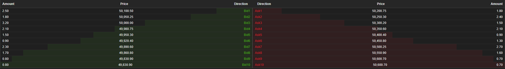
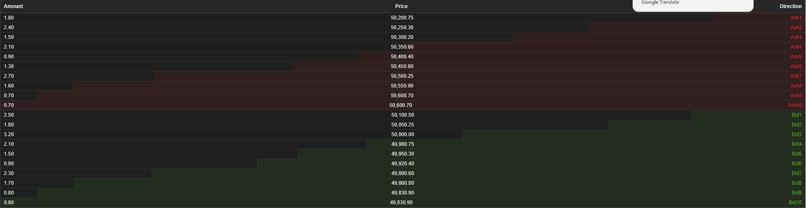
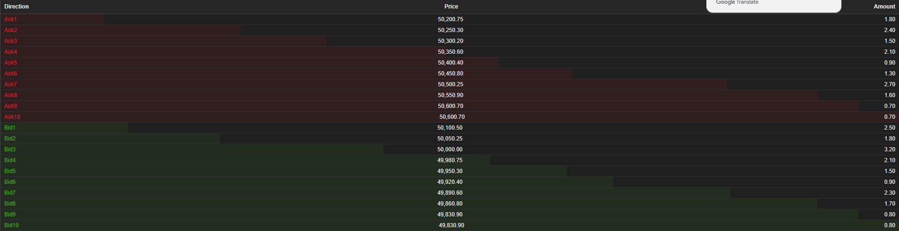
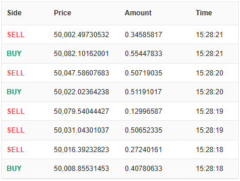
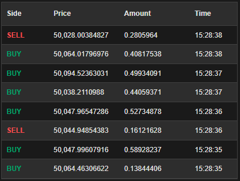

<h1 align="center">
   OrderBook
</h1>
<h4 align="center">
一个订单簿相关的组件集合.
</h4>
<p align="center">
  <a href="https://github.com/0xhappyboy/solana-trader/LICENSE"></a>
</p>
<p align="center">
<a href="./README_zh-CN.md">简体中文</a> | <a href="./README.md">English</a>
</p>

# OrderDepth

## 基础使用

```typescript
import { OrderDepth } from './OrderDepth';

<OrderDepth
  bids={bidsData}
  asks={asksData}
  depth={10}
  displayMode="split"
  theme="dark"
/>

<OrderDepth
  bids={bidsData}
  asks={asksData}
  depth={5}
  displayMode="left"
  theme={{
    backgroundColor: '#1a1a1a',
    bidColor: '#10b981',
    askColor: '#ef4444'
  }}
  locale="en"
  showHeader={true}
/>
```

## Props

| 属性 Property     | 类型 Type                              | 默认值 Default | 说明 Description                    |
| ----------------- | -------------------------------------- | -------------- | ----------------------------------- |
| `bids`            | `OrderDepthItem[]`                     | `[]`           | 买盘数据 Bid data                   |
| `asks`            | `OrderDepthItem[]`                     | `[]`           | 卖盘数据 Ask data                   |
| `depth`           | `number`                               | `5`            | 显示深度 Display depth              |
| `displayMode`     | `'left' \| 'right' \| 'split'`         | `'left'`       | 显示模式 Display mode               |
| `theme`           | `'light' \| 'dark' \| OrderDepthTheme` | `'light'`      | 主题配置 Theme configuration        |
| `locale`          | `'zh-CN' \| 'en' \| OrderDepthLocale`  | `'zh-CN'`      | 语言配置 Language configuration     |
| `showHeader`      | `boolean`                              | `true`         | 是否显示表头 Whether to show header |
| `style`           | `React.CSSProperties`                  | `-`            | 容器样式 Container style            |
| `className`       | `string`                               | `-`            | CSS 类名 CSS class name             |
| `bidColor`        | `string`                               | `-`            | 买盘颜色 Bid color                  |
| `askColor`        | `string`                               | `-`            | 卖盘颜色 Ask color                  |
| `textColor`       | `string`                               | `-`            | 文字颜色 Text color                 |
| `backgroundColor` | `string`                               | `-`            | 背景颜色 Background color           |

## Preview

<div style="display: flex; gap: 5px;"> 
 
 
 
</div>

# OrderFlow

## 基础使用

```typescript
import OrderFlow, { OrderFlowItem } from './OrderFlow';

const orderData: OrderFlowItem[] = [
  {
    id: "1",
    price: 100.5,
    amount: 10,
    side: "buy",
    timestamp: Date.now(),
  },
  {
    id: "2",
    price: 101.2,
    amount: 5,
    side: "sell",
    timestamp: Date.now() - 1000,
  },
];

function App() {
  return (
    <OrderFlow
      data={orderData}
      theme="light"
      buyColor="#00a36c"
      sellColor="#ff4d4f"
    />
  );
}
```

## Props 配置

### Props

| 属性              | 类型                  | 默认值       | 描述               |
| ----------------- | --------------------- | ------------ | ------------------ |
| `data`            | `OrderFlowItem[]`     | `[]`         | 订单数据           |
| `maxItems`        | `number`              | -            | 最大显示条目数     |
| `buyColor`        | `string`              | `'#00a36c'`  | 买入文字颜色       |
| `sellColor`       | `string`              | `'#ff4d4f'`  | 卖出文字颜色       |
| `textColor`       | `string`              | -            | 文字颜色           |
| `backgroundColor` | `string`              | -            | 背景颜色           |
| `showHeader`      | `boolean`             | `true`       | 是否显示表头       |
| `listHead`        | `ListHeadItem[]`      | 默认表头     | 自定义表头配置     |
| `style`           | `React.CSSProperties` | -            | 容器样式           |
| `className`       | `string`              | -            | CSS 类名           |
| `theme`           | `'light' \| 'dark'`   | `'light'`    | 主题样式           |
| `buyText`         | `string`              | `'买入'`     | 买入按钮文本       |
| `sellText`        | `string`              | `'卖出'`     | 卖出按钮文本       |
| `noDataText`      | `string`              | `'暂无数据'` | 无数据时显示的文本 |

### OrderFlowItem

| 属性        | 类型              | 描述           |
| ----------- | ----------------- | -------------- |
| `id`        | `string`          | 订单 ID        |
| `price`     | `number`          | 价格           |
| `amount`    | `number`          | 数量           |
| `side`      | `'buy' \| 'sell'` | 买卖方向       |
| `timestamp` | `number`          | 时间戳（可选） |

### ListHeadItem

| 属性    | 类型                  | 描述                 |
| ------- | --------------------- | -------------------- |
| `key`   | `string`              | 列键名               |
| `text`  | `string`              | 列显示文本           |
| `width` | `number`              | 列宽度百分比（可选） |
| `style` | `React.CSSProperties` | 列样式（可选）       |

## 预览

<div style="display: flex; gap: 5px;">
  
  
</div>
